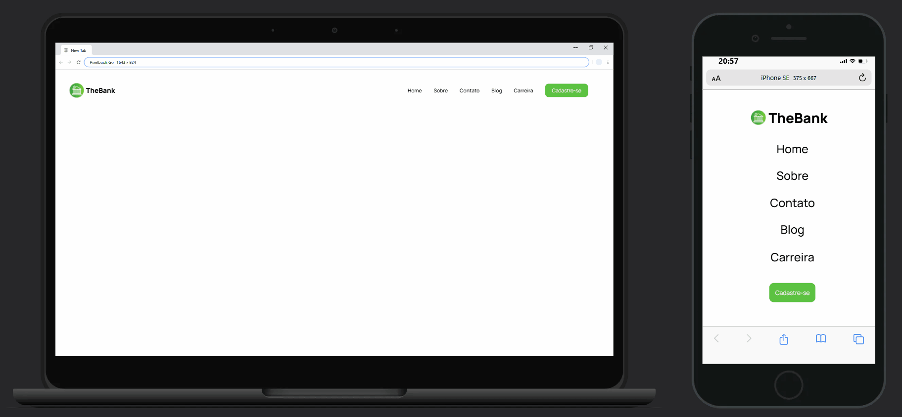
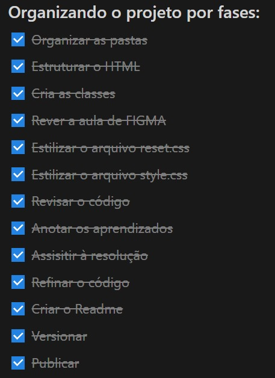

# __Criando um Cabeçalho Responsivo para o TheBank - Desafio DevQuest__

## __Sumário__
- [Apresentação](#apresentação)
- [Explicação do Projeto](#explicação-do-projeto)
- [Tecnologias Utilizadas](#tecnologias-utilizadas)
- [Desafios Enfrentados](#desafios-enfrentados)
- [O Que Aprendi com Este Desafio](#o-que-aprendi-com-este-desafio)
- [Conclusão](#conclusão)

## __Apresentação__

Saudações! Me chamo Mário Miguel, e estou em minha jornada como aspirante a Desenvolvedor Web. Este projeto é minha terceira experiência recriando um layout web sem ajuda direta, e gostaria de compartilhar o processo com você.  
Escrevo este README como uma espécie de diário técnico, onde relato o que aprendi, revisei e os desafios que enfrentei ao longo do caminho. Este desafio faz parte do módulo __*"Exercícios CSS Avançado - Flexbox"*__ do curso __DevQuest__ da _Dev em Dobro_.

## __Explicação do Projeto__

O projeto, chamado __Menu Flexbox__, consiste em criar um cabeçalho responsivo para um site fictício de um banco chamado _"TheBank"_. Esse cabeçalho inclui um menu de navegação e é projetado para se adaptar bem a diferentes tamanhos de tela. O layout é minimalista e traz destaque para o botão verde "Cadastre-se" à direita, incentivando a ação do usuário.

__Principais elementos do projeto:__

- **Logo do _TheBank** à esquerda;
- **Links de navegação** ("Home," "Sobre," "Contato," "Blog," "Carreira") centralizados horizontalmente e com estilização interativa (via passagem do curso do mouse);
- Um **botão "Cadastre-se"** em verde vibrante no canto direito para chamar a atenção.

O objetivo é criar um cabeçalho claro e profissional, que seja funcional em diferentes dispositivos.  
__Abaixo, você pode ver uma prévia do design final:__   

  

## __Tecnologias Utilizadas__

 
  
  
  

## __Desafios Enfrentados__

Um dos principais desafios deste projeto foi padronizar a largura dos itens de navegação, levando em conta o comprimento variável dos textos. Resolvi isso aplicando `padding` verticalmente e definindo uma largura fixa (`width`) para os itens, além de utilizar `text-align: center` para centralizar o texto.  
No geral, não enfrentei grandes dificuldades neste projeto, o que atribuo à __organização prévia__ que fiz antes de iniciar o código. Criei uma lista de objetivos e etapas, o que tornou o processo de desenvolvimento mais fácil e fluido.  
__Veja a imagem desta lista abaixo:__

  

## __O Que Aprendi com Este Desafio__
Neste projeto, aprendi sobre o uso de unidades de medida como `rem`, onde definir o `font-size` do seletor `html` para 10px facilitou o cálculo ao usar essa unidade (aprendizado vindo da resolução do exercício, que acabei não aplicando no meu código). Aprofundei-me no uso de pseudo-classes como `nth-child`, `last-child`, e `hover`, o que permitiu economizar classes. Melhorei a nomeação de classes, a estruturação do HTML e explorei mais sobre espaçamento, distinguindo melhor os elementos a serem estilizados para layout externo e interno. 

## __Conclusão__

Agradeço por dedicar seu tempo para conhecer o meu diário técnico! Este desafio foi um grande passo na minha jornada de aprendizado, onde me senti mais maduro durante a codificação e percebi um progresso significativo em relação aos dois últimos projetos. Ainda há muito a explorar e aprimorar, mas estou motivado para seguir em frente. 

    
    

  

